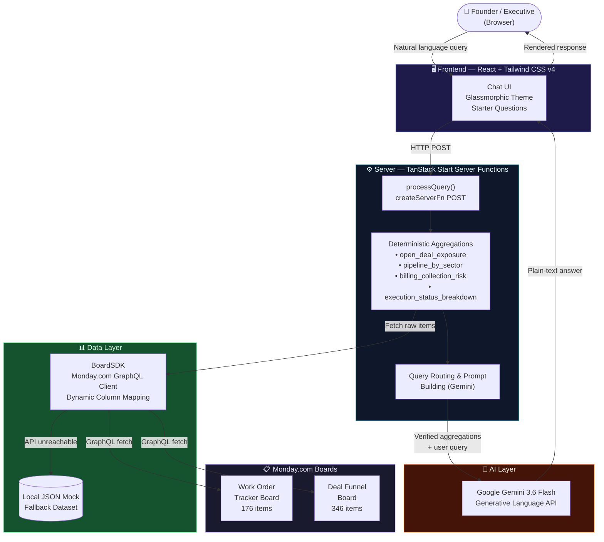

# Skylark Drones — Monday.com BI Agent

> A conversational Business Intelligence agent that connects live to **Monday.com** boards and answers executive-level questions about sales pipeline, execution status, billing risks, and data quality — powered by **React**, **TanStack Start**, and **Google Gemini**.

---

## 🏗️ Architecture



### How a query flows through the system

```
1. User types: "What is our exposure in open deals?"
       ↓
2. React UI → POST to TanStack Server Function
       ↓
3. Server fetches 346 deals + 176 work orders from Monday.com GraphQL
       ↓
4. TypeScript computes deterministic aggregations (no AI math):
   • Filters deals where dealStatus === "Open" → 49 deals
   • Sums maskedDealValue → ₹68.8Cr
   • Groups by sector → Tender ₹53.2Cr, Railways ₹5.2Cr ...
       ↓
5. Verified numbers + user question → sent to Gemini 3.6 Flash
       ↓
6. Gemini returns plain-text executive summary (no JSON, no hallucinations)
       ↓
7. Response rendered in chat UI
```

---

## Tech Stack

| Layer | Technology |
|-------|-----------|
| Framework | React 18 + TanStack Start v1 |
| Routing | TanStack Router |
| Styling | Tailwind CSS v4 |
| Bundler | Vite 8 |
| AI Model | Google Gemini 3.6 Flash |
| Data Source | Monday.com GraphQL API |
| Language | TypeScript |

---

## Monday.com Board Setup

To connect your own Monday.com boards:

1. **Import the Excel files** into Monday.com:
   - `Work_Order_Tracker Data.xlsx` → creates your Work Orders board
   - `Deal funnel Data.xlsx` → creates your Deals board
   - On Monday.com: **Add → Import Data → Excel**

2. **Copy your Board IDs** from the URL when viewing each board:
   - `https://your-team.monday.com/boards/YOUR_BOARD_ID`

3. **Verify these column headers exist** on your boards:

   **Deals Board columns:**
   `Client Code`, `Deal Status`, `Deal Stage`, `Closure Probability`, `Masked Deal value`, `Sector/service`, `Product deal`, `Close Date (A)`, `Tentative Close Date`

   **Work Orders Board columns:**
   `Deal name masked`, `Customer Name Code`, `Serial #`, `Nature of Work`, `Execution Status`, `Sector`, `Amount in Rupees (Excl of GST) (Masked)`, `Billed Value in Rupees (Excl of GST.) (Masked)`, `Collected Amount in Rupees (Incl of GST.) (Masked)`, `Amount Receivable (Masked)`, `Invoice Status`, `Billing Status`, `Type of Work`

---

## Environment Setup

Create a `.env` file at the root of the project:

```env
# Monday.com credentials
MONDAY_API_TOKEN=your_monday_personal_api_token
MONDAY_WORK_ORDERS_BOARD_ID=your_work_orders_board_id
MONDAY_DEALS_BOARD_ID=your_deals_board_id

# Gemini AI
GEMINI_API_KEY=your_gemini_api_key
```

> **No credentials?** The app automatically falls back to bundled mock data and still works fully out-of-the-box.

---

## Running Locally

```bash
# Install dependencies
npm install

# Start development server
npm run dev
```

Open **http://localhost:5173** in your browser.

```bash
# Type-check only
npm run typecheck

# Production build
npm run build
```

---

## Project Structure

```
src/
├── generated/
│   ├── App.tsx                    # Main chat UI component
│   ├── api/
│   │   ├── BoardSDK.ts            # Monday.com GraphQL client
│   │   ├── ai-service.ts          # Gemini API integration
│   │   ├── mock_deals.json        # Fallback deal data
│   │   └── mock_work_orders.json  # Fallback work order data
│   ├── server/
│   │   └── analytics.ts           # Server functions + deterministic aggregations
│   └── components/
│       └── FormattedResponse.tsx  # Chat response renderer
├── routes/                        # TanStack Router pages
└── router.tsx                     # Router config
```

---

## Key Design Decisions

See [`DECISION_LOG.md`](./DECISION_LOG.md) for full details on:
- Why we do math on the server (not in the LLM)
- Tech stack choices and trade-offs
- Assumptions about the data
- What we'd do differently with more time
