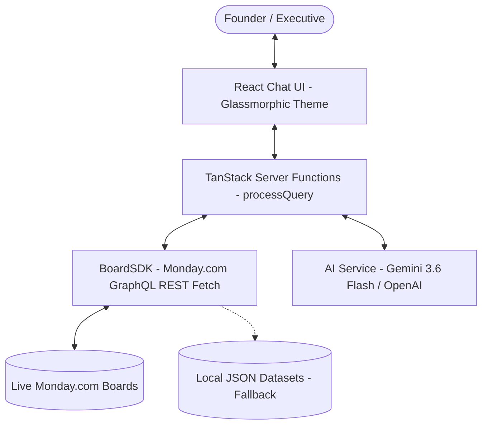

# Skylark Drones - Business Intelligence Dashboard Agent

A conversational Business Intelligence agent built with **React**, **TanStack Start**, and **Google Gemini** that integrates dynamically with **Monday.com** boards to answer executive-level queries about sales pipeline, execution status, billing collections, and data quality.

---

## 1. Architecture Overview



*   **Frontend (React & Tailwind CSS v4):** A premium conversational interface featuring glassmorphism, glowing ambient backgrounds, interactive starter questions, and a reset ("Back to Home") button.
*   **Server Runtime (TanStack Start Server Functions):** Implemented in `analytics.ts` to securely fetch data from live boards and perform deterministic calculations (sums, counts, data quality audits) in TypeScript to eliminate LLM arithmetic hallucinations.
*   **BoardSDK (`BoardSDK.ts`):** Connects to Monday.com's GraphQL API, dynamically maps columns based on human-readable column titles, and falls back to local JSON datasets parsed from the source Excel files if API credentials are missing.
*   **AI Service (`ai-service.ts`):** Connects to Google's Generative Language API using the `gemini-3.6-flash` model (or OpenAI fallback) to generate natural language explanations based on the deterministic server aggregations.

---

## 2. Setup & Monday.com Board Configuration

To import the sample datasets into your Monday.com workspace:

1.  **Download the raw Excel files:**
    *   `Work_Order_Tracker Data.xlsx`
    *   `Deal funnel Data.xlsx`
2.  **Import as new boards:**
    *   On Monday.com, click **Add** -> **Import Data** -> **Excel**.
    *   Upload each Excel sheet separately to create two distinct boards.
3.  **Verify Column Names:**
    *   Our SDK automatically maps column IDs by searching for human-readable column header names. Ensure the headers on your Monday boards contain the following titles:
        *   **Deals Board:** `Client Code`, `Deal Status`, `Deal Stage`, `Closure Probability`, `Masked Deal value`, `Sector/service`, `Product deal`, `Close Date (A)`, `Tentative Close Date`.
        *   **Work Orders Board:** `Deal name masked`, `Customer Name Code`, `Serial #`, `Nature of Work`, `Execution Status`, `Sector`, `Amount in Rupees (Excl of GST) (Masked)`, `Billed Value in Rupees (Excl of GST.) (Masked)`, `Collected Amount in Rupees (Incl of GST.) (Masked)`, `Amount Receivable (Masked)`, `Invoice Status`, `Billing Status`, `Type of Work`.

---

## 3. Environment Configuration

Create a `.env` file at the root of your project directory and configure the following variables:

```env
# 1. Monday.com Live Integration Configuration
MONDAY_API_TOKEN=your_monday_personal_api_token
MONDAY_WORK_ORDERS_BOARD_ID=work_order_tracker_board_id
MONDAY_DEALS_BOARD_ID=deal_funnel_board_id

# 2. AI Completion Integration (Gemini 3.6 Flash)
GEMINI_API_KEY=your_gemini_api_key
```

*If either the Monday token or Gemini API key is not supplied, the application will automatically fall back to local high-fidelity mock data and rules-based completions so that it remains fully functional out-of-the-box.*

---

## 4. Local Development Commands

### Install dependencies
```bash
npm install
```

### Run static code compilation (TypeScript check)
```bash
npm run typecheck
```

### Run local development server
```bash
npm run dev
```
Open **[http://localhost:5173/](http://localhost:5173/)** in your browser.

### Build production bundle
```bash
npm run build
```

---

## 5. Decision Log
Please refer to the [**`DECISION_LOG.md`**](file:///Users/parvathykrishnaa/Downloads/Skylar%20Drone%20Assignment/DECISION_LOG.md) file at the root of the project to review choices regarding tech stack, key assumptions, trade-offs, and leadership updates interpretation.
